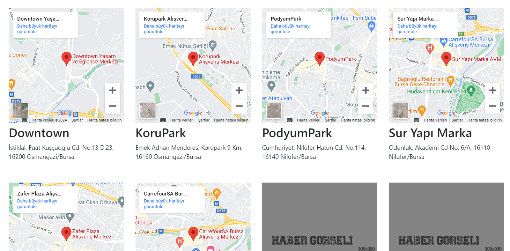
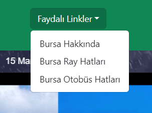
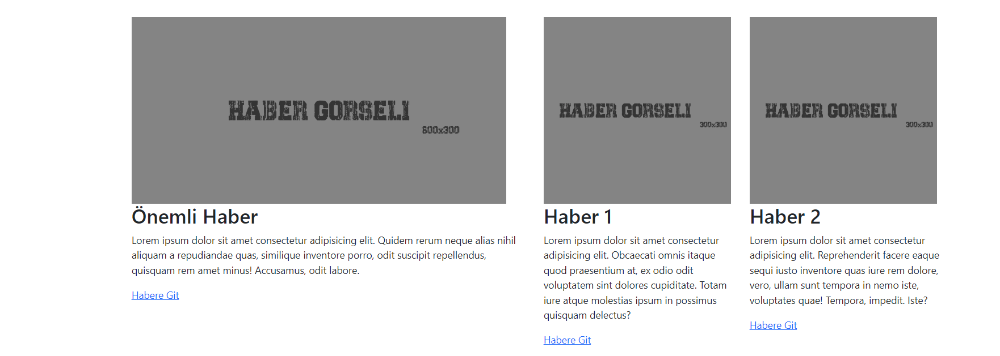

Projemin ismi "Bursa'dayım" 
Temel amacı Bursa'da yaşayan yada yeni gelen son kullanıcılar için Navbar kısmında bulunan arama kutusunda genel arama yapıp "Faydalı Linkler" kısmında Bursa hakkında bilgiler tren ve otobüs hatlarına ulaşabilecekleri sayfalara yönlendirme sağlıyor. Ayrıca ana sayfada bulunan aktif olarak hareketli olan slide üzerinde ki görsellere tıklayıp eğlence ve kültürel amaçla gezi yapabilecekleri yerlerin lokasyonlarına ulaşabiliyorlar. Haberler ile de güncel olarak Bursa'da yaşan kullanıcılar güncel haberlere ulaşabilir. Daha fazla geliştirilerek "Hastahaneler" gibi sağlık taleplerini karşılayabilir yada "Çilingir" gibi esnaflara yönlendirilebilir. Ayrıca reklam alınıp getir elde edilebilir bir projedir.
Temel olarak React, React Dom, Vite, Bootstrap ve CSS kullanılmıştır. Görsel tasarımlar için Photoshop, kodlama desteği için ChatGPT ve CoPilot desteği alınmıştır. Gece gündüz durumuna göre arka planı değişen hava durumu şeridi için https://oneweather.org/ sitesinden yararlandım.
Görseller aşağıda ki gibidir.

